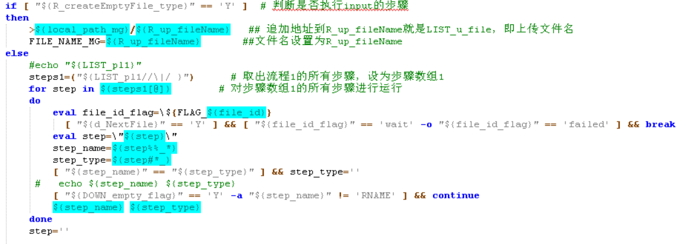
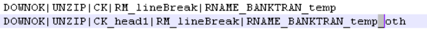
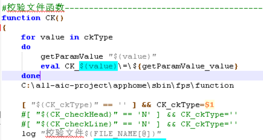
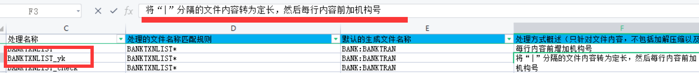
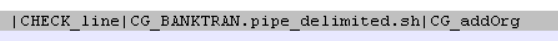
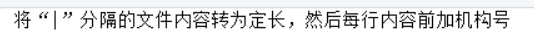
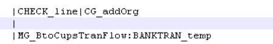
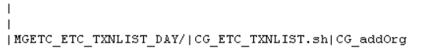
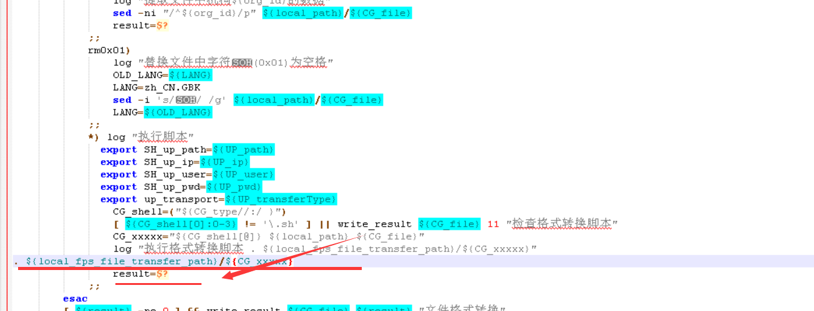
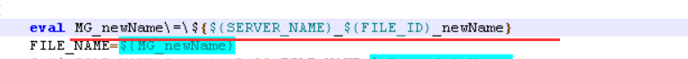

### 执行步骤代码

* step_name=${step%%_*}:保留第一个“—”前的字符串
* step_type=${step#*_}:保留第一个“—”后的字符串
* 对保留字符串进行判断是否相等，相等则说明没有“—”存在。
* 然后我们开始执行方法，举个例子：

* 如果我们的step执行了DOWN，则执行 DOWN方法，传入参数为空。

* 如果执行CK_head1，则执行CK方法，传入参数为head1。

到指定方法查看验证一下：发现确实如此

结合配置文件来看：

分别进入三个方法的执行脚本中：

* FPS_CHECK脚本中：校验文件下载的完整性。
* FPS_CG脚本中：使用了case针对于setup，addOrg、deleteOrg等都定制了属于自己的方法，但都会执行格式转换和结果取出，然后取出第一个“—"后的文件名，将其导入，并且使用这个方法，得到结果。
* BankTRAN.pipe_delimited.sh最后FILE_NAME和result代入使用write_result方法进行文件格式转换。
* CG_addOrg也调用了FPS_CG脚本:使用了sed -i，直接在每一行里输入org_id这个参数。

  查看结果发现和我们上面得出的结果一致。

再来看个BTO的执行流程：

* 前两个和上面那个一样了没什么说的。
* FPS_MG:拼接一个新名出来，然后对传入的两个文件进行判断是否存在，判断完毕后把文件覆盖到新文件名下，然后使用write_result进行文件合并。

会发现结果是一致的。

在看个ETC_TXNLIST_MG执行流程：

* FPS_MGETC：设置新文件名，根据传入的参数设置文件路径，到指定路径下查看文件，把读取到的所有文件名传入到指定路径下如果结果不为0则合并文件。

* 执行格式转换和结果取出，然后取出第一个“—"后的文件名，将其导入，并且使用这个方法，得到结果,最后FILE_NAME和result代入使用write_result方法进行文件格式转换。
* 最后加上机构号。

疑问：

